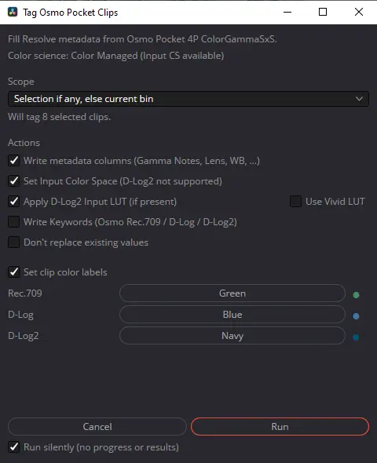

# Tag Osmo Pocket Clips - 4P Metadata Extractor and Tagger for DaVinci Resolve

Tools to read the real color profile information from Osmo Pocket 4P MP4s and tag that metadata to the clips inside DaVinci Resolve.

The Osmo Pocket 4P introduced a new color profile: D-Log2. Unfortunately, this profile is only supported by one of its two camera sensors, the second being limited to D-log. Add to that the various fast and slow modes in Rec.709 and you quickly end up having to deal with multiple color profiles in a project shot on a single device. Unfortunately, the metadata stored within the footage files cannot currently be read by Davinci Resolve, making it harder to sort and grade clips correctly.

This script aims to solve this problem by reading all the metadata stored within the footage files and writing it to the Resolve metadata. The clips themselves are never modified.

DJI stores `com.dji.camera.ColorGammaSxS` (`Rec.709`, `D-Log`, `D-Log2`) in the QuickTime keys atom, but every clip’s HEVC `colr` box stays BT.709 (`nclx 1/1/1`). Resolve only sees that standard tag, so the three profiles look identical on import. This project reads the DJI key and writes Resolve metadata (and optional clip attributes) so you can sort and grade correctly.



## Files

| Path | Role |
| --- | --- |
| `Tag Osmo Pocket Clips.py` | Resolve Utility script (copy into Resolve) |
| `tools/read_osmo_metadata.py` | CLI scanner for a folder or single MP4 |
| `images/panel.webp` | Screenshot of the options dialog |

## Install the Resolve script

1. Copy `Tag Osmo Pocket Clips.py` into Resolve’s **Utility** scripts folder (create the folders if they don’t exist):

| OS | Path |
| --- | --- |
| Windows | `%APPDATA%\Blackmagic Design\DaVinci Resolve\Support\Fusion\Scripts\Utility\` |
| macOS | `~/Library/Application Support/Blackmagic Design/DaVinci Resolve/Fusion/Scripts/Utility/` |
| Linux | `~/.local/share/DaVinciResolve/Fusion/Scripts/Utility/` |

2. Restart Resolve once if the menu item is missing.
3. Run **Workspace → Scripts → Tag Osmo Color**.

If **Scripts** is greyed out: Preferences → System → General → **External scripting using** → **Local**.

Options are remembered between runs:

| OS | Settings file |
| --- | --- |
| Windows | `%APPDATA%\Osmo_4p_Metadata\tag_osmo_color.json` |
| macOS | `~/Library/Application Support/Osmo_4p_Metadata/tag_osmo_color.json` |
| Linux | `~/.config/Osmo_4p_Metadata/tag_osmo_color.json` |

We also recommend installing the D-Log2 → DWG DCTL (Resolve Studio) so Color Managed projects can set a proper D-Log2 input transform — see [D-Log2 IDT](#d-log2-idt-preferred-for-rcm--dwg).

## Using the script

1. Import the MP4s and select clips, or open the bin you want to tag.
2. Run **Tag Osmo Color** and choose scope / actions.
3. Click **Run**.

### Scope

| Choice | Behavior |
| --- | --- |
| Selection if any, else current bin | Uses the Media Pool selection when one exists; otherwise the current bin |
| Selected clips only | Selection only (errors if nothing is selected) |
| Current bin | All clips in the current bin |

**Timelines are not media.** If your selection is only timeline(s), a gate asks what you meant:

1. **Tag clips used on this timeline** — source clips referenced by the edit (handy when one timeline spans many bins)
2. **Tag clips in current bin** — everything in the bin you have open
3. **Cancel**

After you choose, the normal options dialog opens with **Scope locked** (grayed out) to that choice. Mixed selections (media + timelines) skip the gate: media is tagged and timelines are listed under **Ignored**.

### Actions

| Option | Notes |
| --- | --- |
| Write metadata columns | Gamma Notes, Color Space Notes, lens, WB, ISO/EI, camera fields |
| Write Keywords | `Osmo Rec.709` / `Osmo D-Log` / `Osmo D-Log2` for smart bins |
| Set Input Color Space | Rec.709 and DJI D-Gamut/D-Log when Color Managed; D-Log2 uses the Freeman DCTL as Input LUT and tags Input Color Space as **DaVinci WG/Intermediate** |
| Clear Input LUTs when setting Input Color Space | Clears leftover Input LUTs on Rec.709 / D-Log (and on D-Log2 if no DCTL). Default on; skipped when **Don't replace existing values** and a LUT is already set |
| Apply D-Log2 Rec.709 LUT (fallback) | DJI Pocket 4P D-Log2 → Rec.709 cube; disabled when Input CS will apply the DCTL. **Use Vivid LUT** when both variants exist |
| Don’t replace existing values | Skips fields / colors / LUTs that already have a value |
| Set clip color labels | Defaults: Rec.709=Green, D-Log=Blue, D-Log2=Navy (pickers available) |
| Run silently | No progress window and no results dialog |

### Smart bins

With Keywords enabled, create Media Pool smart bins filtered on:

- Keywords contains `Osmo Rec.709`
- Keywords contains `Osmo D-Log`
- Keywords contains `Osmo D-Log2`

### D-Log2 IDT (preferred for RCM / DWG)

Resolve still has no native D-Log2 Input Color Space. For **DaVinci Wide Gamut** grading, install Thatcher Freeman’s community DCTL (D-Log2 → DaVinci Wide Gamut / Intermediate).

**DCTLs require DaVinci Resolve Studio** — the free version does not load `.dctl` files. On free Resolve, use the Rec.709 cube fallback below instead.

1. Download [DJI DLog2 to DWG.dctl](https://github.com/thatcherfreeman/dwg-transforms/blob/main/RCM%20IDTs/DJI%20DLog2%20to%20DWG.dctl) from [dwg-transforms](https://github.com/thatcherfreeman/dwg-transforms) (raw file is fine; keep the `.dctl` extension).
2. Copy it into Resolve’s **LUT library** folder (a `DJI` subfolder is optional but tidy). Easiest: in Resolve, **File → Project Settings → Color Management → Open LUT Folder**.

| OS | Path |
| --- | --- |
| Windows | `%PROGRAMDATA%\Blackmagic Design\DaVinci Resolve\Support\LUT\DJI\` |
| macOS | `/Library/Application Support/Blackmagic Design/DaVinci Resolve/LUT/DJI/` |
| Linux | `/opt/resolve/LUT/DJI/` |

On Windows, `ProgramData` is hidden — paste the path into Explorer’s address bar. **Do not** use `%APPDATA%\Blackmagic Design\DaVinci Resolve\Support\.LUT` — that is Resolve’s LUT *cache* (thumbnails / shaper LUTs). Files dropped there never show up in the DCTL list.

Example final path (Windows):  
`%PROGRAMDATA%\Blackmagic Design\DaVinci Resolve\Support\LUT\DJI\DJI DLog2 to DWG.dctl`

Any subfolder under that `LUT` root works — the script walks the tree. Prefer the exact filename `DJI DLog2 to DWG.dctl`; it also matches any `.dctl` whose name contains `dlog2`/`d-log2` and `dwg`.

3. Fully quit and reopen Resolve so it rescans the library. The DCTL should then appear in the LUT browser and in the DCTL OFX dropdown.

With **Set Input Color Space** enabled on a Color Managed project, D-Log2 clips get that DCTL as their Input LUT (IDT substitute) **and** Input Color Space is set to **DaVinci WG/Intermediate** (the combined-mode menu under DaVinci Intermediate). The DCTL outputs DWG/DI; RCM must be told that so it does not treat the result as Rec.709 (the HEVC default) and convert again — that second transform is why D-Log2 looks gray. Rec.709 and D-Log still use native Input Color Space. The Rec.709 cube fallback does **not** set DWG.

The DCTL matrix is estimated (not an official DJI IDT). Prefer it over Rec.709 cubes when grading in DWG.

### D-Log2 Rec.709 LUTs (fallback)

When the DCTL is not installed — or when you are not using Color Managed Input CS — DJI’s official cubes convert D-Log2 → Rec.709 for monitoring:

Install under Resolve’s LUT folder:

| OS | Path |
| --- | --- |
| Windows | `%PROGRAMDATA%\Blackmagic Design\DaVinci Resolve\Support\LUT\DJI\` |
| macOS | `/Library/Application Support/Blackmagic Design/DaVinci Resolve/LUT/DJI/` |
| Linux | `/opt/resolve/LUT/DJI/` |

Expected names (size33 or size65; size65 preferred):

- `DJI OSMO Pocket 4P D-Log2 to Rec.709 … .cube`
- `DJI OSMO Pocket 4P D-Log2 to Rec.709 vivid … .cube`

If neither is found, the Rec.709 LUT checkbox is disabled. If only one exists, **Use Vivid LUT** is forced on or off to match it. When Input CS will apply the DCTL, the Rec.709 LUT option is disabled so the two transforms cannot stack.

This LUT is a Rec.709 conversion, not a wide-gamut IDT — useful for quick Rec.709 monitoring until Resolve ships a D-Log2 color space.

## Input Color Space needs Color Managed

**Set Input Color Space** only works when the project is color-managed.

1. **File → Project Settings → Color Management**
2. **Color science** = **DaVinci YRGB Color Managed** (not plain DaVinci YRGB)
3. Prefer **Automatic Color Management** off if you want per-clip control
4. Right-click a clip in the Media Pool — **Input Color Space** should appear

On plain **DaVinci YRGB**, that menu is hidden and the checkbox is disabled. Metadata, keywords, clip colors, and Input LUTs still work.

## Wide-gamut grading (RCM)

If you grade in DaVinci Wide Gamut, do **not** manually convert Rec.709 → DWG when RCM is handling the clips. Set the project once, tag Inputs correctly, and grade in the timeline space.

Suggested project settings:

| Setting | Value |
| --- | --- |
| Color science | DaVinci YRGB Color Managed |
| Timeline color space | DaVinci Wide Gamut / DaVinci Intermediate |
| Output color space | Rec.709 Gamma 2.4 (or your delivery) |
| Clip Input (Rec.709) | Rec.709 (or Rec.709 Gamma 2.4) |
| Clip Input (D-Log) | DJI D-Gamut/D-Log |
| Clip Input (D-Log2) | Freeman **DJI DLog2 to DWG.dctl** as Input LUT **and** Input Color Space = **DaVinci WG/Intermediate** (via **Set Input Color Space**), or Rec.709 cube fallback |

What that does:

- Resolve converts **camera Input → DWG** automatically for each clip (D-Log2: DCTL → DWG/DI, then Input tagged DWG so RCM does not convert twice)
- You grade in wide gamut
- Resolve converts **DWG → Output** on monitoring / deliver

Enable **Clear Input LUTs when setting Input Color Space** so leftover Rec.709 cubes on Rec.709 / D-Log clips do not double-transform under RCM. **Don't replace existing values** skips clearing when a LUT is already set.

Wrong path: the project treats D-Log as Rec.709 (default or wrong Input), so you CST Rec.709 → DWG on log footage. Fix the **clip Input** (and project color science), not an extra Rec.709→DWG step.

Node CST workflow (no RCM): keep Color science = DaVinci YRGB, and on D-Log clips use CST **Input = DJI D-Gamut / DJI D-Log → Output = DaVinci Wide Gamut / Intermediate**. Input must match the camera profile, not Rec.709. For D-Log2 without RCM, apply the DCTL or a Rec.709 cube manually on the clip / in a group.

## CLI usage

Scan a camera card folder or a single file without Resolve:

```bash
python tools/read_osmo_metadata.py K:\DCIM\DJI_001
python tools/read_osmo_metadata.py path\to\clip.MP4
python tools/read_osmo_metadata.py path\to\folder --csv colorspaces.csv
```

Prints ColorGammaSxS (and related DJI keys) for each MP4.

## License

Licensed under the MIT License — see [LICENSE](LICENSE).

## Changelog

### v0.2.1

- After the D-Log2 → DWG DCTL, also set clip Input Color Space to **DaVinci WG/Intermediate**. Rec.709 cube fallback is unchanged.

### v0.2.0

- Prefer Thatcher Freeman’s **D-Log2 → DWG DCTL** as the RCM IDT when installed (Resolve Studio); keep DJI Rec.709 cubes as fallback
- **Clear Input LUTs when setting Input Color Space** (default on) so leftover cubes don’t double-transform under RCM
- Timeline-only selection opens a **gate**: tag clips used on the timeline, tag the current bin, or cancel — then Scope is locked in the options dialog
- Mixed media + timeline selections ignore timelines (listed in the report) instead of treating them as offline clips
- Progress window shows a text progress bar while tagging
- Safer timeline matching: refuse ambiguous duplicate timeline names instead of picking the first match
- README documents DCTL install paths, RCM workflow, and the timeline gate

### v0.1

- Initial Resolve Utility script with options dialog (scope, metadata, keywords, clip colors, Input Color Space, D-Log2 Rec.709 LUT, preserve-existing, silent run)
- CLI scanner (`tools/read_osmo_metadata.py`) and project README
